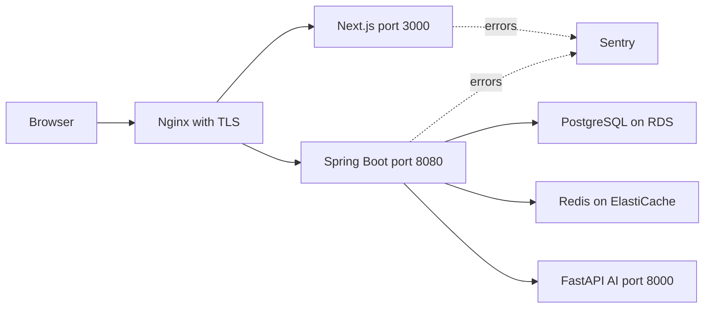
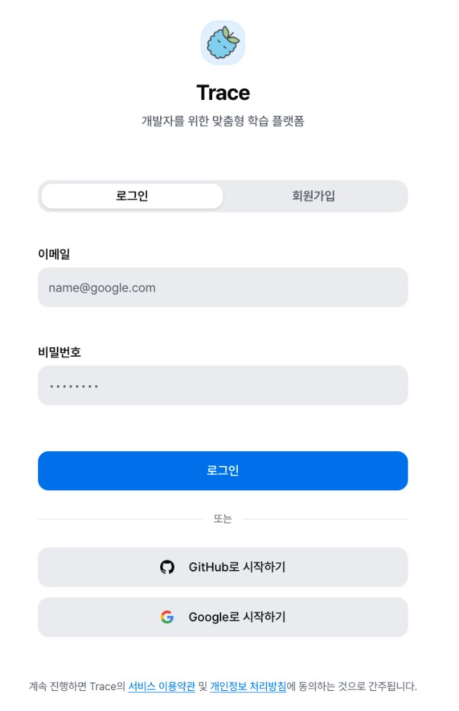
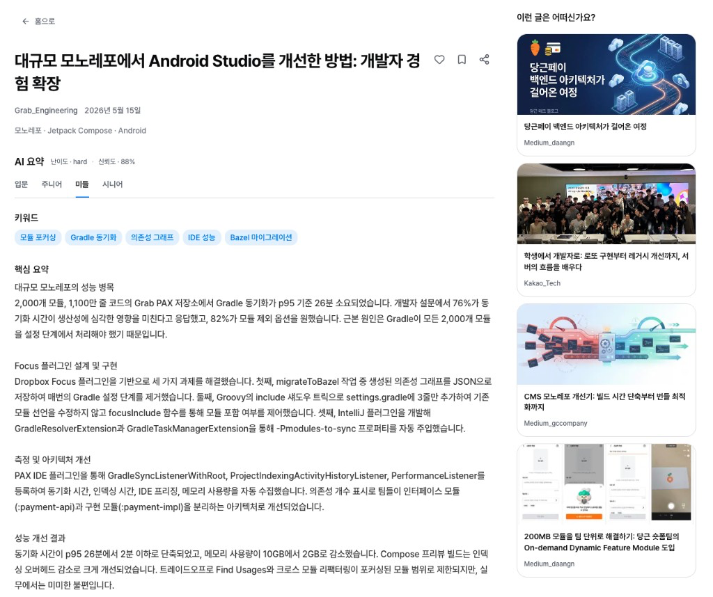
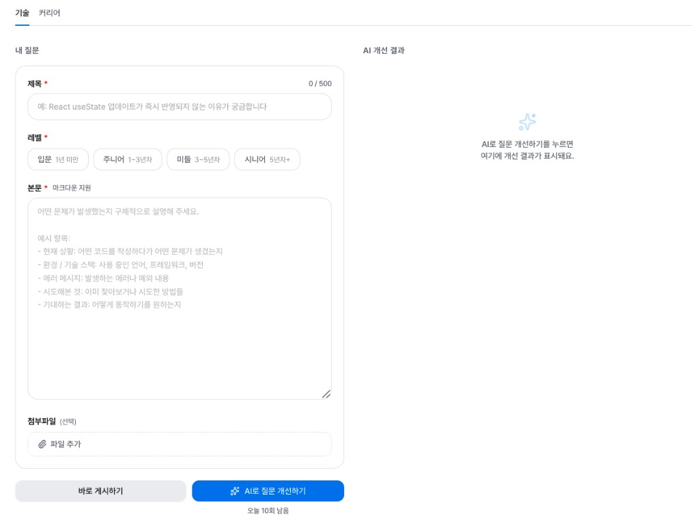
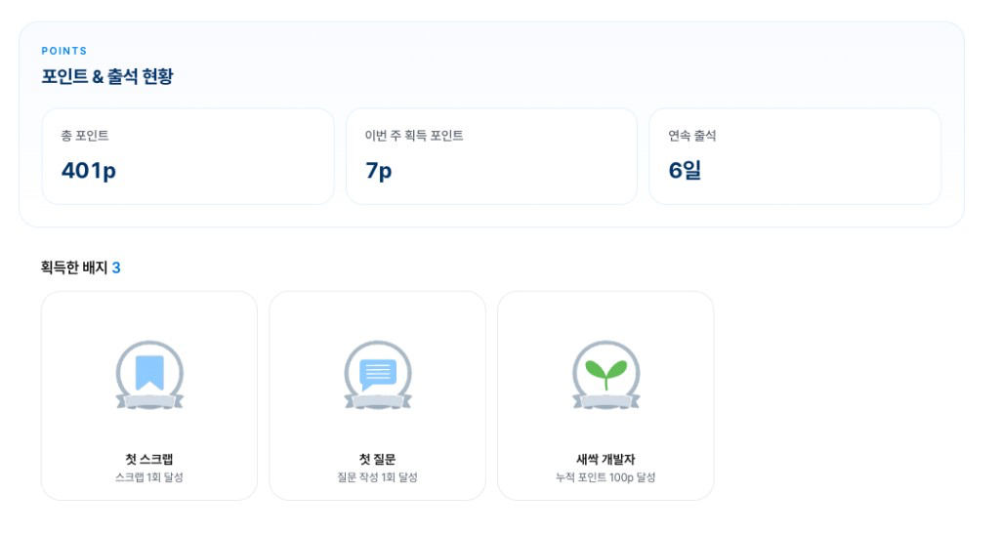
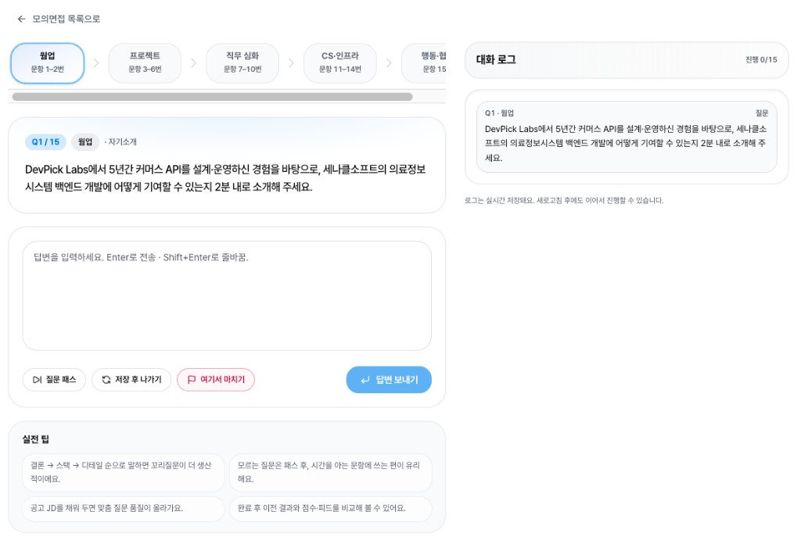
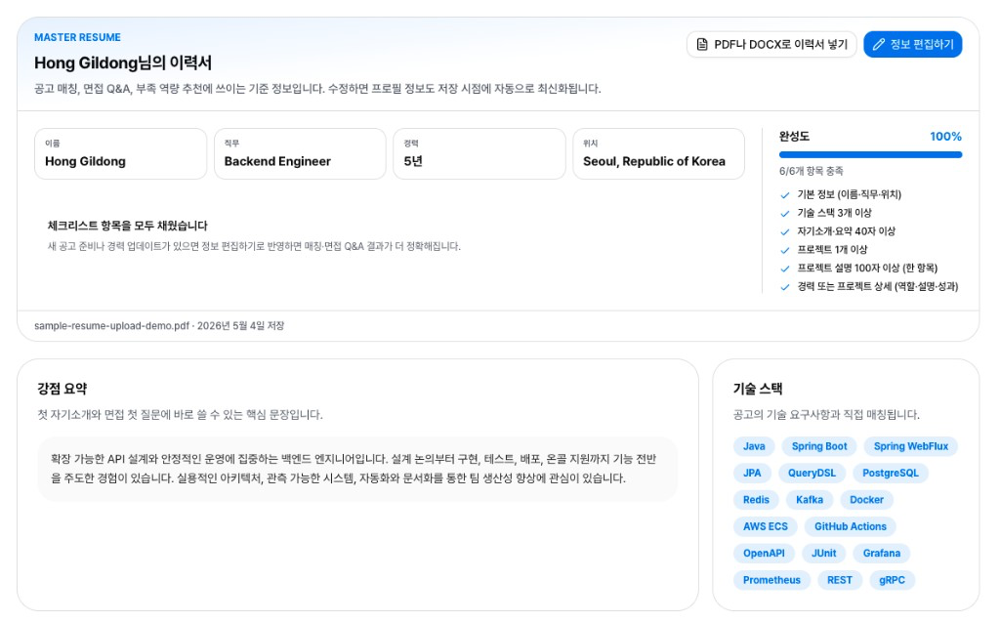
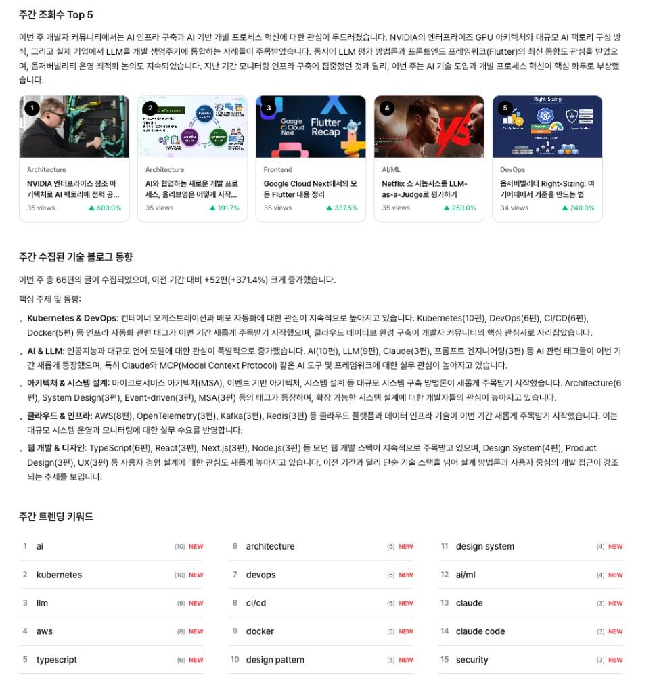
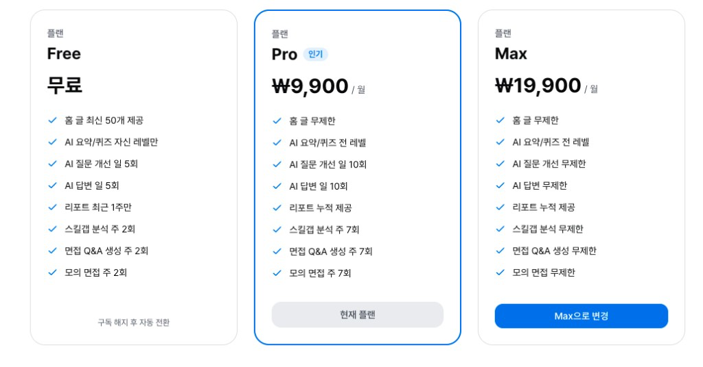

# devpick-frontend

> Trace 개발자 성장 플랫폼의 Next.js 프론트엔드 웹 애플리케이션입니다.
> 전체 프로젝트 소개는 [Devpick-Org](https://github.com/Devpick-Org) 에서 확인할 수 있습니다.

---

## 기술 스택


| 구분            | 기술                      |
|-----------------|---------------------------|
| 언어            | TypeScript                |
| 프레임워크      | Next.js 16.x (App Router) |
| UI 라이브러리   | React 19                  |
| 스타일링        | Tailwind CSS 4.x          |
| 클라이언트 상태 | Zustand                   |
| 서버 상태       | TanStack Query v5         |
| HTTP 클라이언트 | Axios                     |
| 데이터 시각화   | Recharts                  |
| 마크다운 렌더링 | react-markdown            |
| 아이콘          | Lucide React              |
| 패키지 매니저   | npm                       |
| 린트/포맷팅     | ESLint + Prettier         |
| 에러 모니터링   | Sentry                    |
| CI/CD           | GitHub Actions            |
| 결제            | TossPayments SDK          |

---

## 시스템 구조



```
브라우저
  └─ Nginx, TLS
       ├─ Next.js 프론트엔드 port 3000  ← 이 레포
       └─ Spring Boot API 서버 port 8080
              ├─ PostgreSQL on AWS RDS port 5432
              ├─ Redis on AWS ElastiCache port 6379
              ├─ FastAPI AI 서버 port 8000
              └─ Sentry 에러 추적
```

---

## 프로젝트 구조

```
devpick-frontend
├── app/
│   ├── (auth)/              # Route Group — GNB 없는 레이아웃 (랜딩 페이지)
│   ├── (main)/              # Route Group — GNB 있는 레이아웃
│   │   ├── home/            # 콘텐츠 피드, 글 상세, AI 퀴즈
│   │   ├── community/       # 커뮤니티 피드, 게시글 작성·상세
│   │   ├── history/         # 학습 히스토리 (학습·활동·배지 탭)
│   │   ├── profile/         # 내 프로필 설정
│   │   ├── report/          # 주간 학습 분석 리포트
│   │   ├── trends/          # 개발 생태계 트렌드
│   │   ├── plans/           # 구독 플랜 소개 (Free·Pro·Max)
│   │   └── payment/         # 결제 플로우 (billing·success·fail)
│   ├── auth/                # OAuth 콜백 라우트 (GitHub·Google)
│   ├── onboarding/          # 초기 사용자 성향 파악
│   └── report/share/        # 공유 리포트 (비로그인 접근 가능)
├── components/
│   ├── ui/                  # 재사용 프리미티브 (shadcn/ui 기반)
│   ├── layout/              # GNB, 탭바 등 레이아웃 컴포넌트
│   └── features/            # 도메인별 기능 컴포넌트
│       ├── auth/            # 로그인·회원가입·OAuth 콜백
│       ├── home/            # 피드 카드, AI 요약, 퀴즈
│       ├── community/       # 게시글, 답변, AI 답변
│       ├── history/         # 타임라인, 배지, 포인트
│       ├── profile/         # 프로필 수정 폼
│       ├── report/          # 주간 리포트, 공유 리포트
│       ├── trends/          # 트렌드 키워드 시각화
│       ├── jobs/            # 채용 공고 목록·상세
│       ├── resume/          # 이력서 관리
│       ├── subscription/    # 구독 모달, 플랜 카드
│       └── landing/         # 랜딩 페이지
├── lib/
│   ├── api/                 # Axios 인스턴스, 도메인별 API 함수
│   ├── auth/                # 토큰 관리 (Access: Zustand, Refresh: HttpOnly Cookie)
│   └── mock/                # 개발용 목 데이터
├── store/                   # Zustand 전역 상태 (auth, content, ui)
└── types/                   # TypeScript 전역 타입 정의
```

---

## 주요 기능

<table>
  <tr>
    <td align="center" width="33%">
      
      <br />
      <strong>인증과 프로필</strong>
      <br />
      <sub>이메일 회원가입, GitHub Google OAuth2, JWT 갱신, 프로필 조회와 수정</sub>
    </td>
    <td align="center" width="33%">
      
      <br />
      <strong>콘텐츠와 AI 학습</strong>
      <br />
      <sub>개인화 피드, 스크랩, 레벨별 AI 요약, AI 퀴즈, 맞춤 추천</sub>
    </td>
    <td align="center" width="33%">
      
      <br />
      <strong>커뮤니티</strong>
      <br />
      <sub>질문 게시글, 답변 채택, 댓글, 유사 질문, AI 질문 개선, AI 답변</sub>
    </td>
  </tr>
  <tr>
    <td align="center" width="33%">
      
      <br />
      <strong>리포트와 포인트</strong>
      <br />
      <sub>주간 학습 리포트, 공유 링크, PDF 저장, 학습 히스토리, 포인트, 배지</sub>
    </td>
    <td align="center" width="33%">
      
      <br />
      <strong>채용 매칭</strong>
      <br />
      <sub>채용 공고 조회·상세, 북마크, 모의면접 Q&amp;A</sub>
    </td>
    <td align="center" width="33%">
      
      <br />
      <strong>이력서 관리</strong>
      <br />
      <sub>이력서 업로드, 마스터 이력서 저장, AI 기반 보강</sub>
    </td>
  </tr>
  <tr>
    <td align="center" width="33%">
      
      <br />
      <strong>트렌드 분석</strong>
      <br />
      <sub>트렌딩 키워드, 부트캠프·개발행사·개발동아리 생태계 트렌드</sub>
    </td>
    <td align="center" width="33%">
      
      <br />
      <strong>구독과 결제</strong>
      <br />
      <sub>Free·Pro·Max 플랜 비교, 토스페이먼츠 카드 등록, 해지와 환불, 기능 횟수 제한</sub>
    </td>
    <td align="center" width="33%">
    </td>
  </tr>
</table>

---

## Getting Started

### 사전 요구사항

- Node.js 20+
- npm

### 로컬 실행

```bash
git clone https://github.com/Devpick-Org/devpick-frontend.git
cd devpick-frontend
npm install
npm run dev
```

> 기본적으로 `.env.development`의 운영 API(`https://3-39-96-126.sslip.io/v1`)를 사용합니다.
> 로컬 백엔드 서버를 사용하려면 `.env.local`에 아래 내용을 추가하세요.

```bash
# .env.local
NEXT_PUBLIC_API_BASE_URL=http://localhost:8080/v1
NEXT_PUBLIC_TOSS_CLIENT_KEY=test_ck_...   # 토스페이먼츠 테스트 키 (백엔드 팀에게 요청)
```

### 빌드와 테스트

```bash
npm run build   # 프로덕션 빌드
npm run lint    # ESLint 검사
npm test        # Jest 단위 테스트
```

---

## CI/CD

| Job          | 트리거           | 설명                                  |
|--------------|------------------|---------------------------------------|
| Build & Lint | PR → developV2   | ESLint 체크와 Next.js 빌드 검증       |
| Auto Merge   | `automerge` 라벨 | CI 통과 시 developV2 자동 squash 머지 |

---

## 브랜치 전략

| 브랜치                       | 용도                        |
|------------------------------|-----------------------------|
| `main`                       | 배포용                      |
| `develop`                    | MVP                         |
| `developV2`                  | MVP 이후 통합 브랜치        |
| `feature/DP-{번호}-{기능명}` | 기능 개발                   |
| `fix/DP-{번호}-{설명}`       | 버그 수정                   |

---

## 팀

<table>
  <tr>
    <td align="center" width="180">
      <a href="https://github.com/uiuuoq">
        
      </a>
      <br />
      <strong>홍보민</strong>
      <br />
      <sub>Frontend</sub>
      <br />
      <a href="https://github.com/uiuuoq">@uiuuoq</a>
    </td>
  </tr>
</table>
